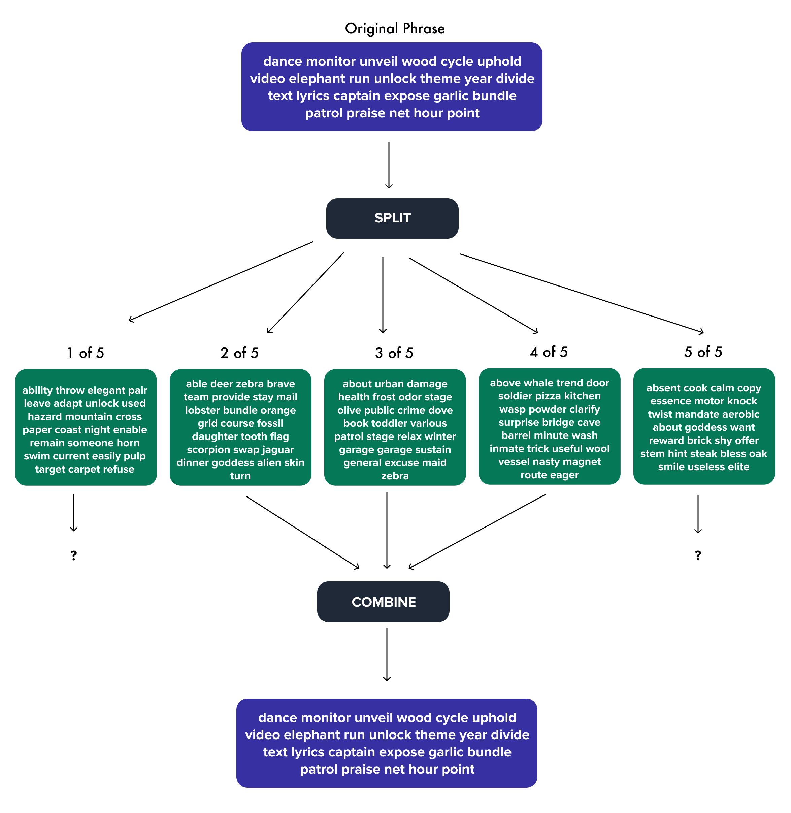

# splitmonic - work in progress

Simplicity of paper backup with security of a multi-signature

## Install

... coming soon ...

## What?

A small program that takes you're 24 word BIP39 mnemonic code and generates 5 more phrases, each
25 words long.

Using any **3 of these 5 phrases** you can recreate your original 24 word mnemonic code

## Why?

The main purpose of this program is to make your paper backups more secure. If you store your
mnemonic code somewhere, that piece of paper is a single point of failure. If an attacker gets
access to that one piece of paper they now have access to all your bitcoin.

With splitmonic an attacker would need to get access to a minimum of 3 of your backups to steal your
bitcoin.

Another advantage of splitmonic is that it allows you to make your backups more durable. Since you only
need 3 of 5 phrases to recreate the original, even if you lost or destroyed 2 of your phrases you could
still recover your original code using the remaining 3.

## How?

...coming soon...

## Example

## FAQ

**Q. Why wouldn't I just use multi-signature?**

**A.** You definitely could, but using multi-signature can be a hassle. With splitmonic you can use
you current single signature hardware wallet as you normally do, while making your backups more
secure.

**Q. If someone finds 1 or 2 of my splitmonic phrases can they guess my original phrase?**

**A.** No. Splitmonic uses [shamir secret sharing](https://en.wikipedia.org/wiki/Shamir%27s_Secret_Sharing)
to split your phrase. Your splitmonic phrases are **NOT** a subset of your original phrase.

## Acknowledgements

- [Nebulosus/shamir](https://github.com/Nebulosus/shamir) - most of the code for the shamir secret sharing algorithm if from this library
- [summa-tx/bitcoins-rs](summa-tx/bitcoins-rs) - the code for the BIP39 word list was inspired from this library
- [jesseduffield/horcrux](https://github.com/jesseduffield/horcrux) - for the idea for the diagram
