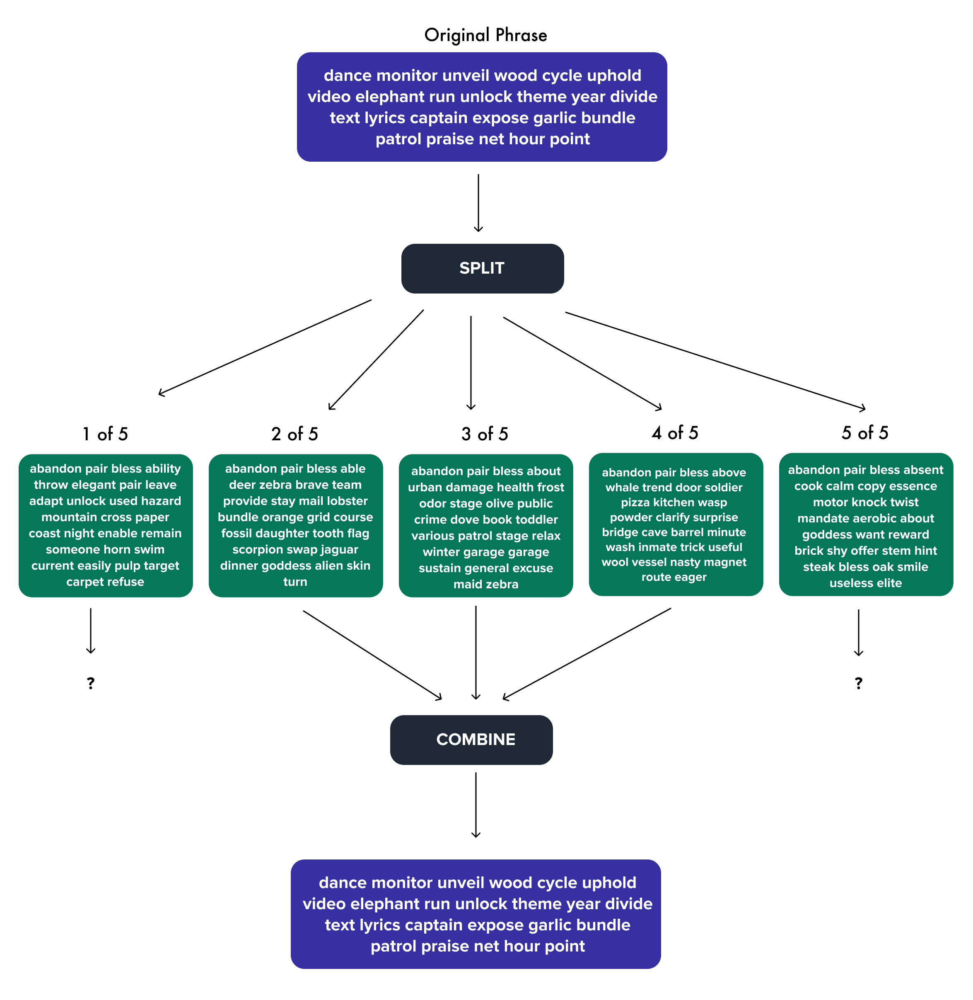
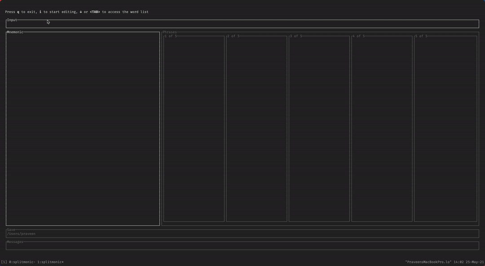
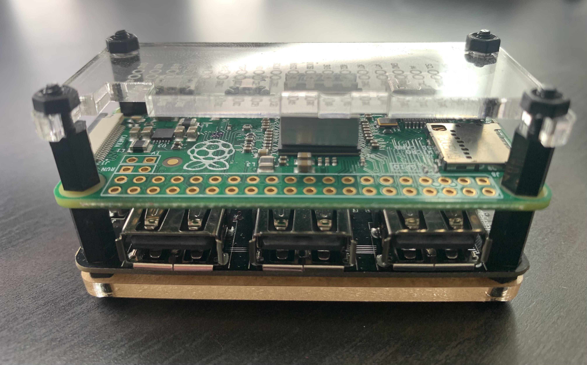

# splitmonic - [](https://github.com/avencera/splitmonic/actions?query=workflow%3A%22Mean+Bean+CI%22)

Split your BIP39 mnemonic phrase using shamir secret sharing



## Install

Install from a github release:

`curl -LSfs https://avencera.github.io/splitmonic/install.sh | sh -s -- --git avencera/splitmonic`

or

Download a release directly from github: [github.com/avencera/splitmonic/releases](https://github.com/avencera/splitmonic/releases)

## Usage

**_Warning: For security reasons, I do not recommend using this on your daily use computer. I personally run this on a Raspberry PI Zero which is never connected to the
internet._**

### Split using TUI

To split your phrase I recommend you use the terminal user interface (TUI). The TUI helps you correctly
type your phrase with autocomplete and error checking.

`splitmonic split --interactive`



### Split using CLI

```
splitmonic-split 0.1.0
Split you're mnemonic into multiple split phrases

USAGE:
    splitmonic split [FLAGS] --mnemonic <mnemonic>

FLAGS:
    -h, --help           Prints help information
    -i, --interactive    use the interactive TUI
    -V, --version        Prints version information
```

You can also use the CLI directly, ex:

```shell
splitmonic split --mnemonic "abandon abandon abandon abandon abandon abandon abandon abandon abandon abandon abandon abandon abandon abandon abandon abandon abandon abandon abandon abandon abandon abandon abandon art"
```

### Combine using TUI

... coming soon ... if you're interested let me know: https://github.com/avencera/splitmonic/issues/3,

### Combine using CLI

```
splitmonic-combine 0.1.0
Combine you're split phrases into your original mnemonic

USAGE:
    splitmonic combine [FLAGS] [OPTIONS] --all-split-phrases <all-split-phrases>... --split-phrase-files <split-phrase-files>...

FLAGS:
    -h, --help           Prints help information
    -i, --interactive    use the interactive TUI
    -V, --version        Prints version information

OPTIONS:
    -s, --all-split-phrases <all-split-phrases>...      3 of 5 split phrases
    -f, --split-phrase-files <split-phrase-files>...    list of files containing your split phrases
    -1, --split-phrases-1 <split-phrases-1>...          first split phrase [aliases: sp1]
    -2, --split-phrases-2 <split-phrases-2>...          second split phrase [aliases: sp2]
    -3, --split-phrases-3 <split-phrases-3>...          third split phrase [aliases: sp3]
```

You can combine using the files that the TUI spit out

```shell
splitmonic combine -f phrases_1_of_5.txt phrases_5_of_5.txt phrases_2_of_5.txt
```

Or buy passing them in directly

```shell
splitmonic combine --sp1="gun, dismiss, area, ability, laptop, live, ignore, love, ride, deposit, upset, enemy, start, leopard, domain, exile, talent, enroll, north, position, talk, hope, script, parent, tongue, ride, pepper, brisk" , --sp2="..." --sp3="..."
```

Or a combination

```shell
splitmonic combine -f phrases_2_of_5.txt phrases_3_of_5.txt --sp1="gun, dismiss, area, ability, laptop, live, ignore, love, ride, deposit, upset, enemy, start, leopard, domain, exile, talent, enroll, north, position, talk, hope, script, parent, tongue, ride, pepper, brisk"
```

## What?

A small program that takes you're 24 word BIP39 mnemonic code and generates 5 more phrases, each
28 words long.

Using any **3 of these 5 phrases** you can recreate your original 24 word mnemonic code

## Why?

The main purpose of this program is to make your paper backups more secure. If you store your
mnemonic code somewhere, that piece of paper is a single point of failure. If an attacker gets
access to that one piece of paper they now have access to all your bitcoin.

With splitmonic an attacker would need to get access to a minimum of 3 of your backups to steal your
bitcoin.

Another advantage of splitmonic is that it allows you to make your backups more durable. Since you only
need 3 of 5 phrases to recreate the original, even if you lost or destroyed 2 of your phrases you could
still recover your original code using the remaining 3.

## FAQ

**Q. Aren't I not supposed to EVER type my secret mnemonic into the computer?**

**A.** Yes, that is a bad idea. You're computer could be compromised and someone could steal all your bitcoin. And if you use the CLI your phrase will stick around in your zsh/bash history file. So at least delete that. Personally I use splitmonic on a raspberry pi zero that's never connected to the internet (picture below).



**Q. Why wouldn't I just use multi-signature?**

**A.** You definitely could, but using multi-signature can be a hassle. With splitmonic you can use
you current single signature hardware wallet as you normally do, while making your backups more
secure.

**Q. Why wouldn't I just use SLIP39?**

**A.** If you have hardware wallet that is compatible with SLIP39, then ya you should probably use that instead

**Q. If someone finds 1 or 2 of my splitmonic phrases can they guess my original phrase?**

**A.** No. Splitmonic uses [shamir secret sharing](https://en.wikipedia.org/wiki/Shamir%27s_Secret_Sharing)
to split your phrase. Your splitmonic phrases are **NOT** a subset of your original phrase.

## Acknowledgements

- [Nebulosus/shamir](https://github.com/Nebulosus/shamir) - most of the code for the shamir secret sharing algorithm if from this library
- [summa-tx/bitcoins-rs](https://github.com/summa-tx/bitcoins-rs) - the code for the BIP39 word list was inspired from this library
- [jesseduffield/horcrux](https://github.com/jesseduffield/horcrux) - for the idea for the diagram
